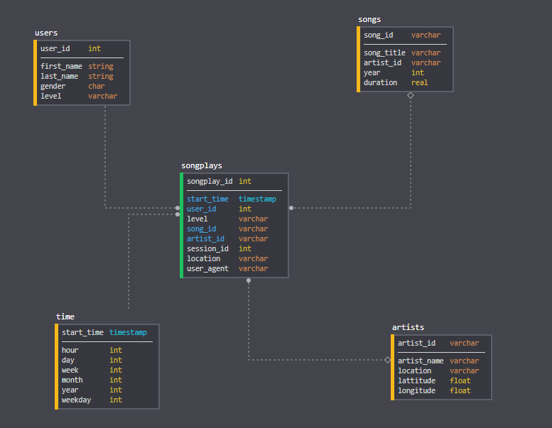

# Project: Data Modeling with Postgres

## Introduction

A startup called Sparkify wants to analyze the data they've been collecting on songs and user activity on their new music streaming app. The analytics team is particularly interested in understanding what songs users are listening to. Currently, they don't have an easy way to query their data, which resides in a directory of JSON logs on user activity on the app, as well as a directory with JSON metadata on the songs in their app.
They'd like a data engineer to create a Postgres database with tables designed to optimize queries on song play analysis, and bring you on the project. Your role is to create a database schema and ETL pipeline for this analysis. You'll be able to test your database and ETL pipeline by running queries given to you by the analytics team from Sparkify and compare your results with their expected results.

## Project Description

In this project, you'll apply what you've learned on data modeling with Postgres and build an ETL pipeline using Python. To complete the project, you will need to define fact and dimension tables for a star schema for a particular analytic focus, and write an ETL pipeline that transfers data from files in two local directories into these tables in Postgres using Python and SQL.
___

## Document Process

> Discuss the purpose of this database in the context of the startup, Sparkify, and their analytical goals.

As Data Engineer at Sparkify I desinged a star schema model to facilitate the processes of queriying the data about the habits of the users of our music platform. Before, such a task was rather complicated since the user activity was only stored in JSON files on user's devices. So it was really complicated gather and aggregate information about customers.
I modeled the database using the Star Schema Model. We have now one Fact table, "songplays" along with four more Dimension tables named "users", "songs", "artists" and "time". We have also developed an automated pipeline to transfer all the informations from JSON files to the tables of our model in Postgres using Python.

> State and justify your database schema design and ETL pipeline.

Because the star schema is denormalized, its structure provides fast agregations and simplified queries and this was everything the analytis team was looking for. As a result, we expect that from now on the task of querying the users data by the analytics team will be much more efficient and will help Sparkify to better know its users, making the company able to improve the experience of users and consequently become more lucrative.
